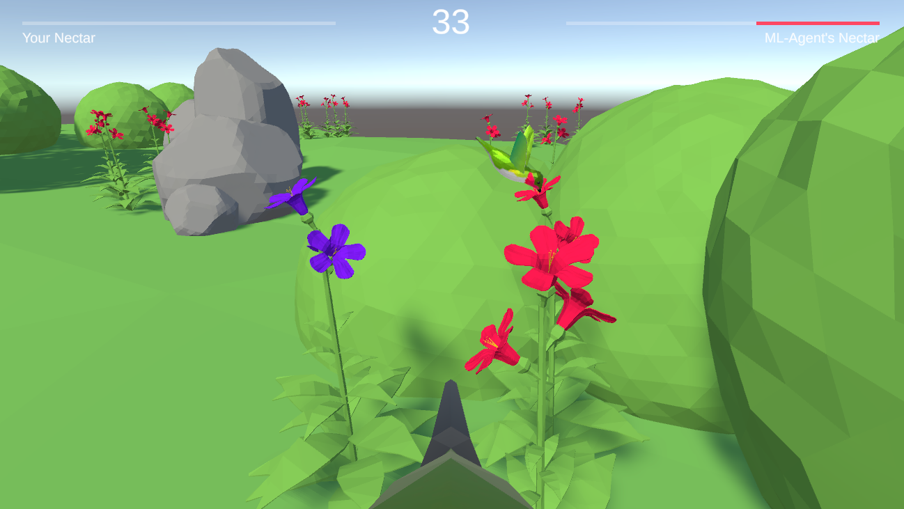

# ML-Agents-Hummingbirds

This Unity ML-Agent project is a game where intelligent hummingbird agents are trained to find and drink nectar from flowers. The environment is simulated within Unity with 3D models and textures, and the agents are trained via a neural network. We used ML-Agent librairy to create the agents and code the logic behind their behavior.

The project also features a mini-game for testing the agents, where two hummingbirds compete against each other to collect nectar from flowers. One of them is controlled by you and the other is an ML agent. The agent can use their observations of the environment and their understanding of the game rules to make decisions and outsmart their opponents.

This project is a great example of how Reinforcement Learning and Unity can be combined to create intelligent agents and simulate complex environments. It is also a demonstration of the potential of Deep Learning in complex environment, and can be a starting point for further research and development.

> This project comes from a [course taken on the Unity Learn platform: ML-Agents : Hummingbirds](https://learn.unity.com/course/ml-agents-hummingbirds?uv=2019.3)

*Player competing with a ML agent to collect nectar from flowers.*

# Environment description

In this Unity ML-Agent project, the environment consists of multiple flowers that the agent must collect nectar from in order to increase its score and reward. The flowers are initially red but turn purple after being depleted of nectar. 

## Agent Observation 

The agent have information of his environment by having its current position, rotation, the distance to the nearest flower, the direction to the nearest flower, how close the agent beak is to pointing at the flower, how close the agent beal is to being in front fo the flower and several Raycast, similar to a LIDAR, to indicate abostacles.

## Agent Reward

The agent is given a reward for collecting nectar from flowers and a negative reward for hitting the ground or boundaries of the training environment. This reward system encourages the agent to learn the environment and collect nectar as efficiently as possible. 

By using these rewards and observations, the agent is able to make more intelligent decisions as it navigates the environment.

## Agent Action 

The agent can interact with the environment by moving in the three direction and by rotating in all axes. We set a limit in the pitch rotation. 

When the adgent's beak is in contact with the collider of the flower nectar, the agent automatically drinks nectar. The flower has a limited amount of nectar.

## Environment Simplification

Here, we simplify some aspects of the environment. After the agent drinks all the nectar, we remove the flower collider in order to help the agent to move away of the flower. It's simplify the learning process of our agent as it only requieres to go to a flower. It also allow the agent to not being stuck after collecting the nectar.

Additionally, the agent do not have to "search" to the flower, as it have the distance and the direction of the nearest one. Thus, the agent do not need to fully explore the map to found flower. It only need to focus on the nectar collection.

This simplification allows us to have an efficient agent. It will be interesting, in the future, to complexify the environment. I think that the flower collider issue will be an easy one compare to the flower reasearch issue. It could be interesting to change the perception of the agent, by using convolution neural networks.

# Unity Environment

In this repository, we create a Unity environment for training ML-Agents and an Unity environment for competiting with a ML-Agent.

